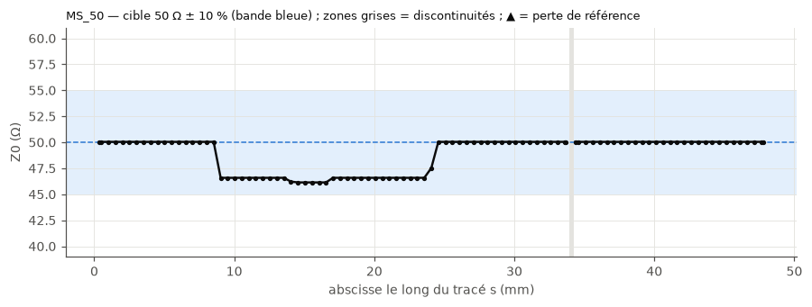
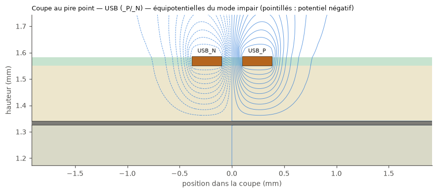
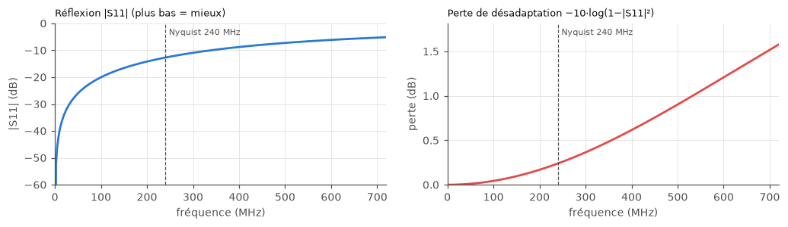
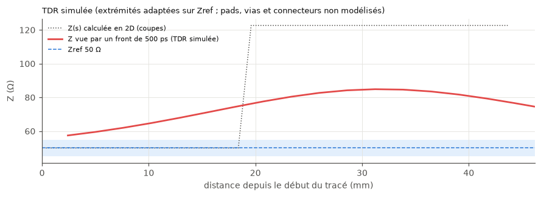
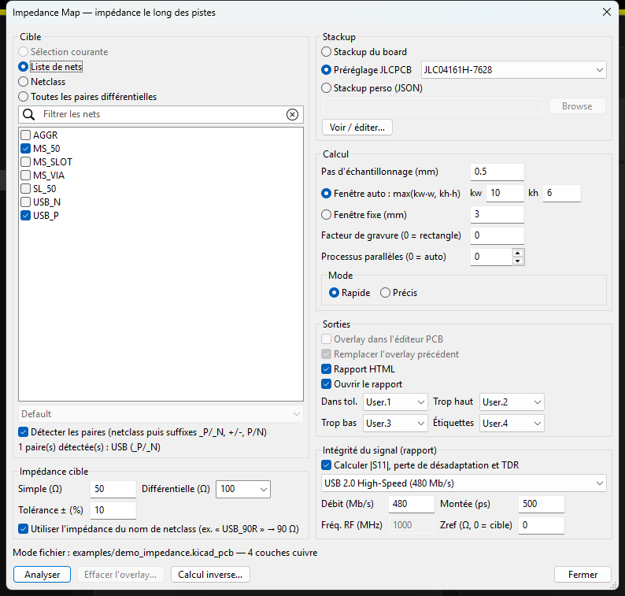

# Impedance Map — plugin KiCad 10

> **English summary** — *Impedance Map* is a KiCad 10 plugin (IPC API, `kipy`) that computes the
> **real characteristic impedance** of single-ended traces and differential pairs **all along their
> route**. At each step it builds a cross-section from the board stackup (or a JLCPCB preset, or a
> custom JSON stackup) and all surrounding copper (neighbour traces, pads, filled zones, floating
> copper), then solves it with a 2D quasi-static electrostatic field solver (validated against Cohn,
> Hammerstad-Jensen, Kirschning-Jansen and Wadell). Results are drawn as an overlay in the PCB editor
> and detailed in a standalone HTML report (interactive board map, Z(s) profile, worst cross-section,
> |S11|, simulated TDR with lumped models of pads, vias, stubs and plane slots). A CLI works without
> KiCad. Install with `python tools/install_plugin.py`. The documentation below is in French.

Simulateur 2D quasi-statique de l'**impédance caractéristique réelle** des pistes simples et des
paires différentielles, **tout le long de leur tracé**. À chaque pas, une coupe perpendiculaire à
la piste est construite à partir du **stackup** (celui du board, un préréglage **JLCPCB** ou un
stackup **perso** en JSON) et de **tout le cuivre environnant** (pistes voisines, pads, plans
remplis, cuivre flottant), puis résolue par un solveur de champ électrostatique. Le résultat est
superposé à la carte dans l'éditeur PCB et détaillé dans un rapport HTML autonome.

Fonctionne sous **Windows** et **Linux** (et macOS, non testé) avec KiCad 10 et l'API IPC (`kipy`).

| Rapport : Z le long du tracé | Rapport : coupe au pire point |
|---|---|
|  |  |
| **Intégrité du signal : \|S11\| et perte de désadaptation** | **TDR simulée (front USB 2.0 de 500 ps)** |
|  |  |
| **Dialogue du plugin** | |
|  | |

La carte du board du rapport est **interactive** (SVG intégré) : échelle en **Ω centrée sur la cible**
(une cible à la fois, ex. « cible 90 Ω »), en **Ω libre** (min/max) ou en **écart %**, infobulle au
survol, zoom à la molette.

Rapport complet d'exemple : [examples/demo_report.html](examples/demo_report.html).

---

## Sommaire
1. [Fonctionnalités](#fonctionnalités)
2. [Installation](#installation) — Windows, Linux, Flatpak, macOS
3. [Utilisation](#utilisation) — dialogue, overlay, rapport, calcul inverse, CLI
4. [Stackups](#stackups) — board, JLCPCB, perso (format JSON)
5. [Hypothèses physiques](#hypothèses-physiques)
6. [Limites](#limites)
7. [Validation](#validation)
8. [Performance](#performance)
9. [Dépannage](#dépannage)
10. [Structure du dépôt](#structure-du-dépôt)
11. [Pistes d'évolution](#pistes-dévolution)
12. [Licence](#licence)

---

## Fonctionnalités

* **Cibles** : sélection courante, liste de nets, netclass, ou toutes les paires différentielles.
  Paires détectées par netclass puis par suffixes `_P/_N`, `+/-`, `P/N` (ex. `USB_DP`/`USB_DN`).
  L'impédance cible peut être lue dans le nom de la netclass (`USB_90R` → 90 Ω).
* **Stackup au choix** : celui du board (lu par l'API), un des **32 stackups d'impédance JLCPCB**
  (4 et 6 couches, 1,6 mm, relevés sur jlcpcb.com/impedance) + 7 stackups 2 couches dérivés, ou un
  **stackup perso** (JSON, éditable dans le dialogue).
* **Coupes réelles** : tout le cuivre de toutes les couches (zones = remplissages réels, jamais les
  contours), masque de soudure conforme, trapèze de gravure optionnel.
* **Physique** : matrice de capacités C et C0, L = μ0ε0·C0⁻¹, Z0 et εeff (simple) ; analyse modale
  (Zodd, Zeven, Zdiff, Zcomm, Z0 de chaque brin, coefficient de couplage) pour les paires.
* **Discontinuités** (coins, arcs serrés, pads, vias, changements de couche, virages de paire) marquées
  au lieu d'afficher une valeur 2D sans sens ; **pertes de référence** (fente, bord de plan) signalées.
* **Cache** des coupes identiques (géométrie quantifiée + hachage, mémoire et disque) et **calcul
  parallèle** multiprocessus, avec barre de progression et annulation.
* **Overlay** dans l'éditeur : tronçons sur 3 couches User (dans la tolérance / trop haut / trop bas),
  étiquettes « 51.8 Ω » / « Zdiff 93 Ω », marqueurs ; **un seul commit** pour les objets (un Ctrl+Z)
  et **un groupe** identifiable (créé juste après) ; action **« Effacer l'overlay »** avec décompte et confirmation.
* **Rapport HTML autonome** : carte interactive du board (échelle en Ω ou en %), courbe Z(s) avec bande
  de tolérance, coupe au pire point avec équipotentielles, tableau min / max / moyenne / % hors tolérance.
* **Intégrité du signal** : à partir du profil Z(s) réel, |S11| (return loss) et **perte de désadaptation**
  en fréquence, **TDR simulée** (impédance vue par un front de montée réel) et **réflexion crête** ;
  préréglages USB 2.0 HS, USB 3.x, PCIe, HDMI, MIPI, Ethernet, numérique perso ou RF (fréquence).
* **Discontinuités modélisées** dans ce calcul (modèles localisés) : **pads** sur le trajet (ΔC), **vias**
  (fût coaxial, antipad mesuré, inductance de boucle sans via de retour), **stubs de via**, **stubs de
  piste** (branches en T, points de test), **coins** et **fentes** du plan (L = 0,2·D·ln(D/W) nH). Le rapport
  compare « ligne seule » et « avec discontinuités ».
* **Bonus** : calcul inverse (largeur, ou gap, pour une Z cible sur une couche) et détection des
  changements de couche **sans via de retour** proche.

## Installation

### Prérequis communs
1. **KiCad 10** (testé avec 10.0.6).
2. **Activer le serveur API** : KiCad → *Préférences → Plugins → Activer le serveur API*, puis
   redémarrer KiCad.
3. Récupérer le dépôt puis installer le plugin dans le dossier des plugins IPC
   (`${KICAD_DOCUMENTS_HOME}/10.0/plugins`) :

```bash
git clone https://github.com/bastien313/KiCad_ImpedanceMap.git
```
```bash
cd KiCad_ImpedanceMap
```
```bash
python tools/install_plugin.py
```

   (`--link` pour un lien symbolique pendant le développement, `--dest DOSSIER` pour forcer un dossier,
   `--uninstall` pour retirer). Vous pouvez aussi copier à la main `plugin.json`, `requirements.txt`,
   `impedance_map_action.py`, `impedance_map_clear.py`, `impedance_map/` et `icons/` dans un
   sous-dossier `impedance-map/` du dossier des plugins.
4. Relancer KiCad. Au premier chargement, **KiCad crée un venv dédié** au plugin
   (`${KICAD_CACHE_HOME}/python-environments/org.impedancemap.kicad-plugin`, avec
   `--system-site-packages`) et y installe `requirements.txt` (kicad-python, numpy, scipy, shapely,
   matplotlib). Cela peut prendre une minute ; le bouton apparaît ensuite dans la barre d'outils de
   l'éditeur PCB.

### Windows
* Dossier : `%USERPROFILE%\Documents\KiCad\10.0\plugins\impedance-map`.
* KiCad utilise son Python embarqué (3.11) : **wxPython est fourni**, l'interface wx est utilisée.
* Rien d'autre à installer.

### Linux (paquet natif)
* Dossier : `~/.local/share/kicad/10.0/plugins/impedance-map`.
* KiCad utilise le premier `python3` du PATH. Le venv du plugin est créé automatiquement
  (PEP 668 respecté : rien n'est installé dans le Python système).
* Si `python3-venv` manque : `sudo apt install python3-venv` (Debian/Ubuntu/Mint).
* Interface : wxPython si présent dans le Python système (`sudo apt install python3-wxgtk4.0`),
  sinon repli automatique **tkinter** (`sudo apt install python3-tk` si absent).

### Linux Flatpak
* Dossier : `~/.var/app/org.kicad.KiCad/data/kicad/10.0/plugins/impedance-map`
  (détecté automatiquement par `tools/install_plugin.py` si le Flatpak est installé).
* Le Python du runtime Flatpak est utilisé ; wx est normalement disponible dans le runtime KiCad.
* Le rapport HTML est écrit dans le dossier du projet (`<projet>/impedance_map/`), accessible au sandbox.

### macOS (non testé)
* Dossier : `~/Documents/KiCad/10.0/plugins/impedance-map` ; Python embarqué de KiCad (wx inclus).

### Développement (sans KiCad)
```bash
python -m venv .venv
```
```bash
.venv/bin/pip install -r requirements.txt pytest
```
```bash
.venv/bin/python -m pytest
```
(sous Windows : `.venv\Scripts\python`). Le solveur, l'extraction depuis un fichier, le rapport et
la CLI fonctionnent sans KiCad.

## Utilisation

### Dans KiCad
1. Ouvrir le board, **remplir les zones** (touche `B`) : le calcul n'utilise que les remplissages
   réels ; si des zones ne sont pas remplies, le plugin prévient et propose d'annuler.
2. (Option) sélectionner les pistes à analyser.
3. Cliquer sur le bouton **Impedance Map** de la barre d'outils.
4. Choisir la **cible**, l'**impédance** (défauts : 50 Ω simple, 100 Ω diff — 90 Ω pour USB via
   netclass —, ±10 %), le **stackup**, le **pas** (0,5 mm), la **fenêtre** (auto : max(10·w, 6·h))
   et le **mode** (rapide / précis).
5. **Analyser**. À la fin :
   * overlay : couches `User.1` (dans la tolérance), `User.2` (trop haut), `User.3` (trop bas),
     `User.4` (étiquettes, marqueurs ○ des discontinuités, « perte réf. ») — couches paramétrables ;
     si une couche est désactivée dans le board, une autre couche utilisateur active est prise à la
     place (message) ;
   * rapport HTML (+ résultats JSON) dans `<dossier du projet>/impedance_map/`, ouvert dans le navigateur.
6. **Effacer l'overlay** : bouton du dialogue ou action « Impedance Map : effacer l'overlay »
   (menu Outils > Plugins externes). Seuls les objets du plugin sont supprimés, après décompte et
   confirmation ; annulable par Ctrl+Z.

> KiCad 10 ne permet pas de colorer individuellement un objet par l'API (seules les couleurs de couche
> et de net/netclass existent, et elles sont globales). D'où les trois couches User : choisissez-leur
> des couleurs contrastées dans le panneau Apparence (ex. vert / rouge / bleu).

### Intégrité du signal : quelle « perte » regarder ?
Une impédance incorrecte ne **dissipe** pas d'énergie : elle en **réfléchit** une partie. La perte de
désadaptation −10·log(1 − |S11|²) est donc faible en dB (≈ 0,1–0,3 dB pour des paires USB à 64 Ω au lieu
de 90 Ω) et n'est pas le bon critère pour une liaison numérique. Pour l'USB et les liaisons rapides, le
rapport donne ce qui compte réellement :
* la **réflexion crête** vue par un front du temps de montée du standard (TDR simulée, en %) — elle
  produit sonnerie et interférence entre symboles ;
* le **return loss jusqu'à la fréquence de Nyquist** (débit / 2), grandeur spécifiée par les normes (SDD11).
Pour une piste RF/analogique, choisir « RF / analogique » : return loss, VSWR et perte de désadaptation à
la fréquence d'intérêt ont alors tout leur sens.

Modèle : cascade de tronçons de ligne sans pertes (Z et εeff de chaque coupe), extrémités adaptées sur
Zref (défaut : la cible), et **modèles localisés des discontinuités** du chemin principal :

| Discontinuité | Modèle | Mesuré sur le board |
|---|---|---|
| Pad sur le trajet (ESD, point de test traversé…) | tronçon court de Z et εeff locaux : coupe 2D avec le cuivre du même net fusionné (≡ ΔC, ΔL) | forme réelle du pad |
| Via (changement de couche) | fût = ligne coaxiale Z = 60/√εr·ln(D2/d) ; + excédent d'inductance de Johnson 0,2·h·(ln(4h/d)+1) nH s'il n'y a pas de via de retour à moins de 1 mm | perçage, antipad D2 (remplissages), hauteur, via de retour |
| Stub de via | partie du fût au-delà des couches utilisées = ligne ouverte en dérivation (résonance c/(4l√εr)) | couches traversées |
| Stub de piste (branche en T) | ligne ouverte en dérivation construite avec les Z calculées sur la branche | longueur et Z réelles |
| Coin | ΔC = C′ × excès de surface de cuivre / w (négligeable à 45°) | géométrie au sommet |
| Fente sous la piste | L série = 0,2·D·ln(D/W) nH (Johnson) ; paire : × 2(1 − k) | D et W par lancer de rayons sur le plan |

Hypothèse : discontinuités courtes devant la longueur du front (quasi-statique). Pour une paire, chaque
élément est ramené au mode différentiel (brins supposés identiques). Non modélisés : connecteurs,
composants, virages de paire (interpolés). Exemple : `examples/demo_discontinuites.kicad_pcb` et son rapport
[examples/demo_discontinuites_report.html](examples/demo_discontinuites_report.html).

| Board démo, front 500 ps | Ligne seule | Avec discontinuités |
|---|---|---|
| Pad CMS 1,0 × 1,2 mm sur une microstrip 50 Ω | 0,0 % | 1,7 % (ΔC ≈ 243 fF) |
| Branche en T de 8 mm (point de test) | 0,0 % | 5,8 % (résonance ≈ 5 GHz) |
| Fente 8 × 1 mm dans le plan | 0,0 % | 6,7 % (L ≈ 3,3 nH) |
| Même stub, USB 3.x 10 Gb/s (Nyquist 5 GHz) | 0,0 % | **34,9 %**, return loss 0,5 dB |

### Calcul inverse
Bouton **Calcul inverse…** : couche, Z cible, type (simple ; paire à gap fixé → largeur ; paire à
largeur fixée → gap). Coupe canonique : plans pleins sur les couches adjacentes, masque conforme.
Exemple (JLC04161H-7628, F.Cu) : 50 Ω → w = 0,350 mm ; 90 Ω diff avec gap 0,2 mm → w = 0,283 mm.

### Ligne de commande
```bash
python -m impedance_map analyze examples/demo_impedance.kicad_pcb --pairs --nets MS_50 SL_50 --report rapport.html
```
```bash
python -m impedance_map analyze mon_board.kicad_pcb --netclass USB_90R --stackup jlcpcb:JLC04161H-7628
```
```bash
python -m impedance_map analyze --live --pairs --overlay
```
```bash
python -m impedance_map synth --stackup jlcpcb:JLC04161H-7628 --layer F.Cu --z 90 --gap 0.2
```
```bash
python -m impedance_map stackups --layers 6
```
```bash
python -m impedance_map ui examples/demo_impedance.kicad_pcb
```
Options utiles de `analyze` : `--step`, `--window`, `--mode precise`, `--etch`, `--tol`, `--z`,
`--zdiff`, `--json`, `--workers`, `--no-cache` ; intégrité du signal : `--signal "USB 3.x Gen 1 (5 Gb/s)"`,
`--bitrate` (Mb/s), `--rise` (ps), `--freq` (MHz, mode RF), `--zref`, `--no-signal`.

## Stackups

| Source | Choix | Remarques |
|---|---|---|
| Board | « Stackup du board » | Lu par l'API (kicad-python ≥ 0.8 / KiCad ≥ 10.0.6 pour εr et masque détaillés) ; repli sur la section `(setup (stackup …))` du fichier sinon. |
| JLCPCB | liste filtrée par nombre de couches | 32 stackups officiels relevés sur <https://jlcpcb.com/impedance> le 2026-09-25 : Dk prepreg 7628 = 4,4 ; 3313 = 4,1 ; 1080 = 3,91 ; 2116 = 4,16 ; core = 4,6 ; masque C1 = 1,2 mil, C2 = 0,6 mil, εr 3,8. Les stackups 2 couches sont **dérivés** (non publiés comme stackups d'impédance), marqués « non officiel ». Régénération : `python tools/fetch_jlcpcb_stackups.py`. |
| Perso | fichier JSON | Créé depuis le dialogue (« Voir / éditer… » → « Enregistrer sous… ») ou à la main. |

Le nombre de couches cuivre du stackup doit correspondre au board (les noms sont réattribués dans
l'ordre F.Cu, In1.Cu, …, B.Cu).

**Format JSON** (unités mm, couches de haut en bas) — exemple complet :
[examples/stackup_perso_exemple.json](examples/stackup_perso_exemple.json)
```json
{"name": "Mon stackup", "units": "mm", "layers": [
  {"kind": "mask", "name": "F.Mask", "thickness": 0.03048, "er": 3.8, "mask_c2": 0.01524},
  {"kind": "copper", "name": "F.Cu", "thickness": 0.035},
  {"kind": "dielectric", "name": "prepreg 1", "thickness": 0.2104, "er": 4.4, "dielectric_type": "prepreg"},
  {"kind": "copper", "name": "In1.Cu", "thickness": 0.0152},
  {"kind": "dielectric", "name": "core", "thickness": 1.065, "er": 4.6, "dielectric_type": "core"},
  {"kind": "copper", "name": "In2.Cu", "thickness": 0.0152},
  {"kind": "dielectric", "name": "prepreg 2", "thickness": 0.2104, "er": 4.4, "dielectric_type": "prepreg"},
  {"kind": "copper", "name": "B.Cu", "thickness": 0.035},
  {"kind": "mask", "name": "B.Mask", "thickness": 0.03048, "er": 3.8, "mask_c2": 0.01524}]}
```
L'épaisseur d'un diélectrique est la distance entre les faces des cuivres qui l'encadrent
(convention KiCad et JLCPCB). `mask_c2` : épaisseur du masque au-dessus d'une piste (défaut :
`thickness`). `dielectric_type` sert à savoir quelle résine remplit les niveaux cuivre internes
(prepreg) et de quel côté est la base d'une piste gravée (core).

## Hypothèses physiques

Détail complet : [docs/PHYSICS.md](docs/PHYSICS.md).

* **Quasi-TEM, électrostatique 2D** : ∇·(ε∇φ) = 0 dans la coupe ; conducteurs parfaits ; milieu
  non magnétique. C (diélectriques réels), C0 (vide), L = μ0ε0·C0⁻¹, Z0 = √(L/C), εeff = C/C0.
* **Paire** : Zc = (√(LC))⁻¹·L ; Zdiff = Z11 + Z22 − 2 Z12 ; Zcomm = (Z11 + Z22 + 2 Z12)/4 ;
  Zodd = Zdiff/2 ; Zeven = 2 Zcomm ; k = (Zeven − Zodd)/(Zeven + Zodd).
* **Voisins** : lignes au repos à **0 V** (convention standard). **Cuivre sans net** : conducteur
  **flottant**, charge nette nulle (un corps par îlot). Cuivre du **même net** loin de la piste
  (> 2 w) : au repos ; proche : discontinuité.
* **Référence** : uniquement le cuivre présent dans la coupe (fentes, trous, changements de plan
  apparaissent naturellement). Pas de plan sous/sur la piste (±w) ni de masses coplanaires des deux
  côtés (< 3 w) → **perte de référence** (valeur non affichée, marqueur).
* **Domaine** : fenêtre latérale max(10·w, 6·h) (+ empreinte de la paire), bords latéraux de Neumann
  (un plan coupé au bord est prolongé à l'infini), air au-dessus/dessous (10 × épaisseur de carte) à
  0 V. Un plan à la masse couvrant toute la fenêtre isole exactement ce qui est au-delà : le domaine
  est coupé sur ce plan.
* **Diélectriques** : tranches du stackup ; niveaux cuivre internes remplis par la résine du prepreg
  adjacent ; masque conforme (C1 sur substrat, C2 sur et autour des pistes externes).
* **Numérique** : différences finies (volumes finis) sur grille rectilinéaire non uniforme raffinée
  aux arêtes, scipy.sparse (LU), capacité par charge de Gauss discrète (= énergie), 2–3 niveaux de
  grille + **extrapolation de Richardson** ; estimation d'erreur fournie.

## Limites

* **Hors périmètre** : pertes (diélectriques, conducteur), dispersion en fréquence, rugosité,
  effet de peau ; les Z sont des valeurs quasi-statiques. L'intégrité du signal est calculée sur une
  ligne sans pertes (seul l'effet de l'impédance est évalué).
* Modèle **2D** : coins, arcs de faible rayon (< demi-fenêtre), pads, vias, extrémités, virages de
  paire et changements de couche sont exclus (marqués « discontinuité ») ; l'effet d'une fente est
  vu seulement quand la coupe est dans la fente.
* Pistes voisines **obliques** : coupées selon la ligne de coupe (largeur apparente = w/cos θ).
* Vias et pads traversants proches de la piste (< max(1,5 w, h)) → discontinuité ; plus loin, seuls
  leurs pastilles de cuivre sont prises en compte (pas le fût).
* Pads « custom » lus depuis un **fichier** : approximés (ancre + polygones) ; en direct, la forme
  exacte est demandée à KiCad.
* Stackup du board : sous-couches diélectriques multiples OK en direct ; lues comme une seule couche
  depuis un fichier.
* Paires asymétriques : Zdiff via la matrice d'impédance caractéristique (exact en milieu homogène,
  approximation quasi-TEM usuelle en microstrip).

## Validation

Tests pytest exécutés (121 tests, dont 36 de validation du solveur et 14 d'intégrité du signal et de
modèles localisés) — **tableau complet :
[docs/VALIDATION.md](docs/VALIDATION.md)** (généré à partir des résultats réels).

| Référence | Seuil | Pire écart rapide | Pire écart précis |
|---|---|---|---|
| Stripline t = 0 vs **Cohn** (exact) | < 1 % | 0,25 % | 0,07 % |
| Paire stripline vs **Cohn** couplé (exact) | < 1 % | 0,16 % | 0,08 % |
| Microstrip vs **Hammerstad-Jensen** (t = 0 et t = 35 µm) | < 3 % | 0,16 % | 0,25 % |
| Paire microstrip vs **Kirschning-Jansen** | < 3 % | 0,39 % | 0,51 % |
| Coplanaire + plan vs **Wadell** | < 3 % | 0,93 % | 1,01 % |

Intégrité du signal (tests/test_signal.py, tests/test_discontinuities.py) : ligne adaptée (S11 = 0),
transformateur quart d'onde exact, conservation |S11|² + |S21|² = 1, TDR retrouvant l'impédance d'un tronçon,
front lent masquant un tronçon court ; capacité en dérivation et inductance série (formules exactes), stub
ouvert (court-circuit au quart d'onde, capacité en basse fréquence) ; détection sur le board démo des pads,
stub, via + stub de via + via de retour, fente (dimensions mesurées) et pads d'une paire.

Plus : convergence de grille (ordre ≈ 1), sensibilité fenêtre (×2 : < 0,3 % ; ÷2 : < 1 %), hauteur
d'air (< 0,5 %), plan flottant (capacité série exacte), masque, trapèze, paire asymétrique, cache ;
extraction sur le board d'exemple (voisine, îlot flottant, fente, via sans retour, stripline,
paire), overlay (un commit, groupe, effacement sélectif) et rapport.

## Performance

Mesures réelles (`python tools/benchmark.py`, CPU AMD Zen 4 — 12 cœurs logiques, Windows 11, Python 3.13,
cache disque désactivé) :

| Cas | Mode | Temps |
|---|---|---|
| Paire USB 103,5 mm du board d'exemple (209 coupes, 2 uniques) | rapide | **0,36 s** |
| Idem | précis | 5,2 s |
| Idem, cache par coupe neutralisé (209 résolutions réelles) | rapide | **6,7 s** |
| Board réel (4 paires USB, 212 mm, 204 coupes uniques) | rapide | 9,9 s → **4,7 s / 100 mm** |

Objectif « paire de 100 mm en < 30 s en mode rapide » : atteint, y compris sans cache. Une coupe
unique coûte ≈ 30 ms (rapide, 11 processus) ; le mode précis est ≈ 30× plus coûteux par coupe.

## Dépannage

| Symptôme | Cause / solution |
|---|---|
| « Impossible de lire le board … connect » | Serveur API désactivé : Préférences → Plugins → Activer le serveur API, puis **fermer complètement et relancer** KiCad. Le serveur API ne démarre pas si l'éditeur PCB est lancé seul (double-clic sur un `.kicad_pcb`) : ouvrir le projet depuis le gestionnaire de projets KiCad. |
| Venv créé avec le mauvais Python | Préférences → Plugins → interpréteur Python : choisir celui de KiCad 10 (Windows : `C:\Program Files\KiCad\10.0\bin\pythonw.exe`), puis recréer l'environnement du plugin. |
| « KiCad est occupé (AS_BUSY) » | Un outil ou un dialogue est actif : Échap, fermer les dialogues, cliquer dans le canevas, relancer. |
| Bouton absent | Recharger les plugins (Préférences → Plugins) ; consulter `Documents/KiCad/10.0/logs/api.log` et le journal du plugin (`%LOCALAPPDATA%\impedance_map\plugin.log`, `~/.cache/impedance_map/plugin.log`). |
| Premier lancement long | Création du venv et installation de numpy/scipy/shapely/matplotlib par KiCad. |
| Valeurs 2× trop basses/hautes | Vérifier le **stackup** : l'épaisseur des diélectriques domine le résultat (comparer « board » et « JLCPCB »). |
| « Zones non remplies » | Remplir les zones (B) puis relancer. |
| Linux sans wx | Repli tkinter automatique ; installer `python3-tk` si nécessaire. |

## Structure du dépôt

```
plugin.json                 déclaration du plugin IPC (schéma https://go.kicad.org/api/schemas/v1)
requirements.txt            dépendances installées par KiCad dans le venv du plugin
impedance_map_action.py     action principale (dialogue)
impedance_map_clear.py      action « effacer l'overlay »
icons/                      icônes 24/48 px, thèmes clair/sombre
impedance_map/
  solver/                   solveur 2D autonome (géométrie, maillage, FD, lignes, formules, API)
  stackup/                  modèle, sources (kipy, fichier, JSON), préréglages JLCPCB (data/)
  extraction/               lecture board (kipy / .kicad_pcb), cibles & paires, échantillonnage, coupes
  analysis/                 moteur (cache, parallélisme, statistiques)
  viz/                      plan d'overlay, application kipy, rapport HTML
  ui/                       contrôleur, dialogue wx, repli tkinter
  synthesis.py              calcul inverse
  cli.py                    ligne de commande
tests/                      pytest (validation solveur, physique, stackup, extraction, overlay, rapport)
examples/                   board d'exemple (+ générateur), rapport d'exemple, stackup perso
tools/                      installation, benchmark, icônes, relevé JLCPCB, tableau de validation
docs/                       ARCHITECTURE, PHYSICS, VALIDATION, captures
```

Pour **modifier le projet** : lire [docs/ARCHITECTURE.md](docs/ARCHITECTURE.md) (flux de données,
modules, conventions) et [docs/PHYSICS.md](docs/PHYSICS.md) (modèle physique et numérique).
Conventions : unités internes en mètres (kipy en nanomètres, converti uniquement dans
`kipy_reader.py` et `overlay_kicad.py`) ; imports de `kipy`/`wx` paresseux pour que le solveur,
l'extraction fichier, le rapport et les tests tournent sans KiCad ; après un changement du solveur ou
des coupes, incrémenter `CACHE_VERSION` (`impedance_map/analysis/cache.py`), relancer la validation
(`python -m pytest tests/test_solver_validation.py` puis `python tools/validation_table.py`) et
mettre à jour [CHANGELOG.md](CHANGELOG.md).

Les sous-paquets `solver/`, `extraction/`, `viz/`, `ui/` sont regroupés dans le paquet
`impedance_map/` pour éviter toute collision de nom avec d'autres paquets du venv KiCad
(`--system-site-packages`).

## Pistes d'évolution

Non vérifié à ce jour :
* **Linux / Flatpak / macOS** : développé et testé sous Windows 11 uniquement ; le code est portable
  (pathlib, `spawn`, aucune dépendance Windows) et les chemins d'installation suivent la doc KiCad.
* Cible **« sélection courante »** avec des pistes réellement sélectionnées dans KiCad.

Idées (non faites) :
* Intégrité du signal : connecteurs et composants (S-paramètres fournis), pertes (tan δ, effet de
  peau, rugosité), couplage entre les deux vias d'une paire, virages de paire, diagramme de l'œil,
  export Touchstone (.s2p), validation des modèles localisés contre un solveur 3D (openEMS).
* Pertes et dispersion : solveur fréquentiel (R, G via tan δ et résistance de surface).
* Sous-couches diélectriques multiples et pads « custom » exacts en lecture fichier.
* Préréglages d'autres fabricants (même format JSON).
* Export CSV des échantillons ; comparaison avant/après entre deux analyses.
* Paquet PCM (Gestionnaire de contenus KiCad).

Contributions et rapports de bugs bienvenus via les
[issues](https://github.com/bastien313/KiCad_ImpedanceMap/issues).

## Licence

Distribué sous licence **GNU GPL v3 ou ultérieure** — voir [LICENSE](LICENSE).
Les préréglages JLCPCB (`impedance_map/stackup/data/jlcpcb_stackups.json`) sont relevés sur la page
publique <https://jlcpcb.com/impedance> ; JLCPCB est une marque de son propriétaire, ce projet n'y
est pas affilié.
